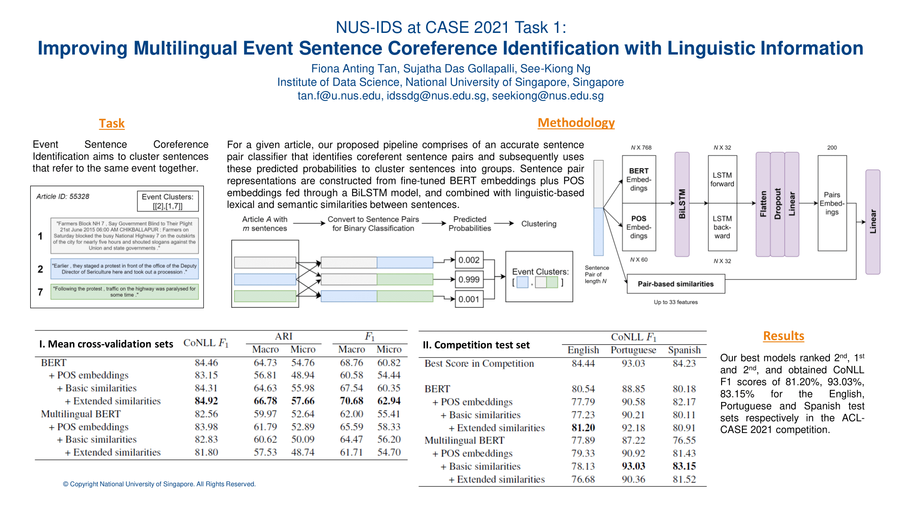

<a href='https://aclanthology.org/2021.case-1.14'>Download paper here</a>

<a href='https://github.com/NUS-IDS/EventSentenceCoref'>Visit our Github respository here</a>

Event Sentence Coreference Identification (ESCI) aims to cluster event sentences that refer to the same event together for information extraction. We describe our ESCI solution developed for the ACL-CASE 2021 shared tasks on the detection and classification of socio-political and crisis event information in a multilingual setting. For a given article, our proposed pipeline comprises of an accurate sentence pair classifier that identifies coreferent sentence pairs and subsequently uses these predicted probabilities to cluster sentences into groups. Sentence pair representations are constructed from fine-tuned BERT embeddings plus POS embeddings fed through a BiLSTM model, and combined with linguistic-based lexical and semantic similarities between sentences. Our best models ranked 2nd, 1st and 2nd and obtained CoNLL F1 scores of 81.20%, 93.03%, 83.15% for the English, Portuguese and Spanish test sets respectively in the ACL-CASE 2021 competition.
