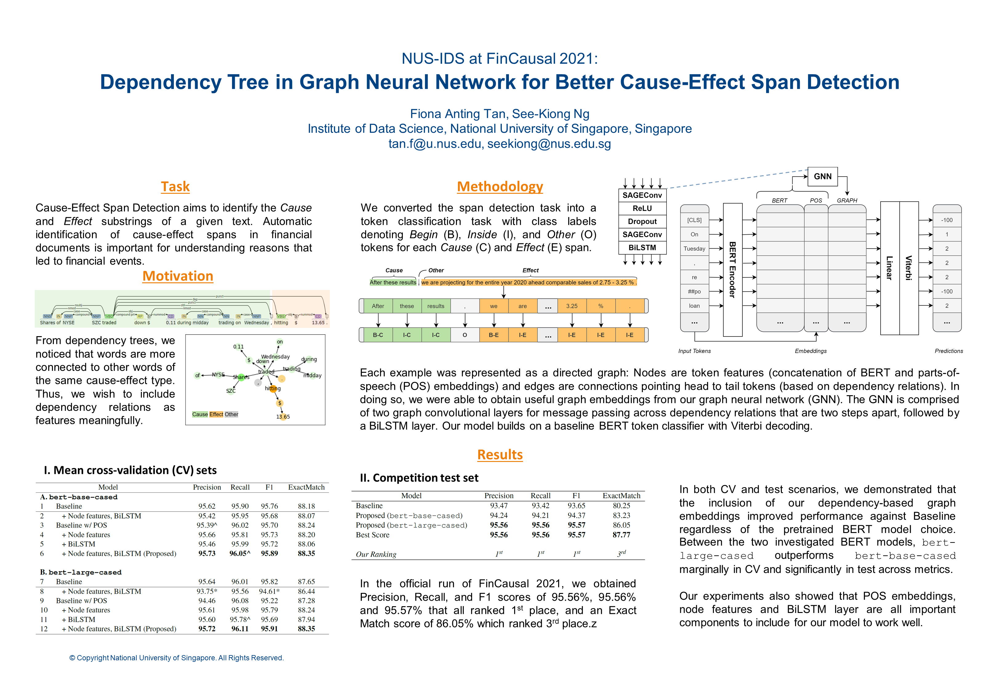

<a href='https://aclanthology.org/2021.fnp-1.6'>Download paper here</a>

<a href='https://github.com/tanfiona/causeeffectdetection'>Visit our Github respository here</a>

Automatic identification of cause-effect spans in financial documents is important for causality modelling and understanding reasons that lead to financial events. To exploit the observation that words are more connected to other words with the same cause-effect type in a dependency tree, we construct useful graph embeddings by incorporating dependency relation features through a graph neural network. Our model builds on a baseline BERT token classifier with Viterbi decoding (Kao et al., 2020), and outperforms this baseline in cross-validation and during the competition. In the official run of FinCausal 2021, we obtained Precision, Recall, and F1 scores of 95.56%, 95.56% and 95.57% that all ranked 1st place, and an Exact Match score of 86.05% which ranked 3rd place.
