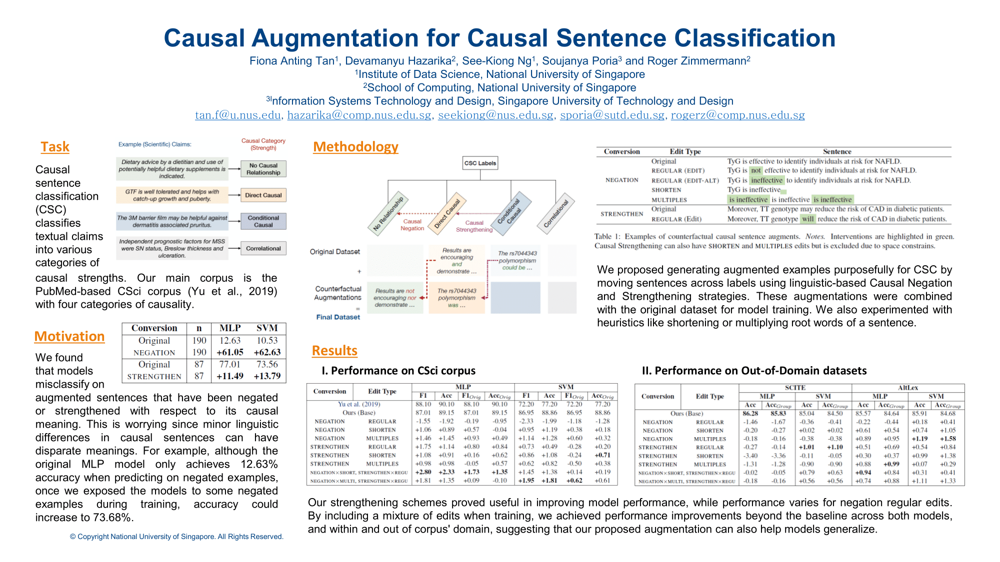

<a href='https://aclanthology.org/2021.cinlp-1.1'>Download paper here</a>

<a href='../files/slides/CausalAugment_CINLP_2021.pdf'>Download presentation slides here</a>

<a href='https://github.com/tanfiona/CausalAugment'>Visit our Github respository here</a>

<h2>Abstract</h2>
Scarcity of annotated causal texts leads to poor robustness when training state-of-the-art language models for causal sentence classification. In particular, we found that models misclassify on augmented sentences that have been negated or strengthened with respect to its causal meaning. This is worrying since minor linguistic differences in causal sentences can have disparate meanings. Therefore, we propose the generation of counterfactual causal sentences by creating contrast sets (Gardner et al., 2020) to be included during model training. We experimented on two model architectures and predicted on two out-of-domain corpora. While our strengthening schemes proved useful in improving model performance, for negation, regular edits were insufficient. Thus, we also introduce heuristics like shortening or multiplying root words of a sentence. By including a mixture of edits when training, we achieved performance improvements beyond the baseline across both models, and within and out of corpus’ domain, suggesting that our proposed augmentation can also help models generalize.
