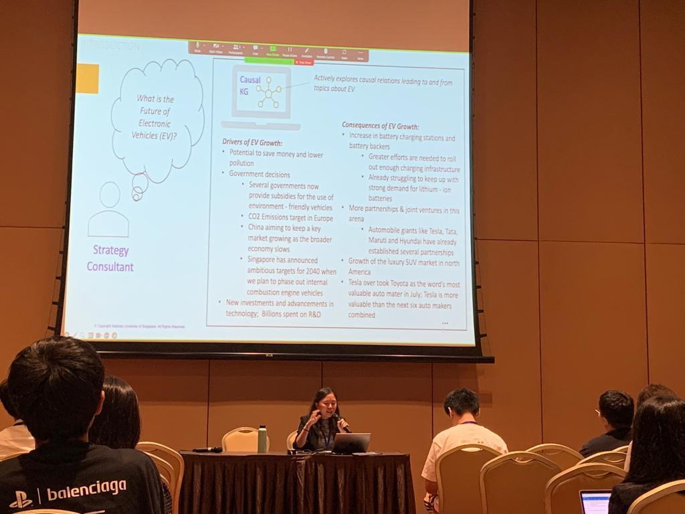

<a href='https://ojs.aaai.org/index.php/AAAI-SS/article/view/27476'>Download paper here</a>

<a href='../files/slides/Panasonic_AAAI-SS_2023.pdf'>Download presentation slides here</a>

<h2>Abstract</h2>
Many jobs rely on news to learn about causal events in the past and present, to make informed decisions and predictions about the future. With the ever-increasing amount of news and text available on the internet, there is a need to automate the extraction of causal events from unstructured texts. In this work, we propose a methodology to construct causal knowledge graphs (KGs) from news using two steps: (1) Extraction of Causal Relations, and (2) Argument Clustering and Representation into KG. We aim to build graphs that emphasize on recall, precision and interpretability. For extraction, although many earlier works already construct causal KGs from text, most adopt rudimentary pattern-based methods. We close this gap by using the latest BERT-based extraction models alongside pattern-based ones. As a result, we achieved a high recall, while still maintaining a high precision. For clustering, we utilized a topic modelling approach to cluster our arguments, so as to increase the connectivity of our graph. As a result, instead of 15,686 disconnected subgraphs, we were able to obtain 1 connected graph that enables users to infer more causal relationships from. Our final KG effectively captures and conveys causal relationships, validated through multiple use cases and user feedback.

<h2>Event Photos</h2>

