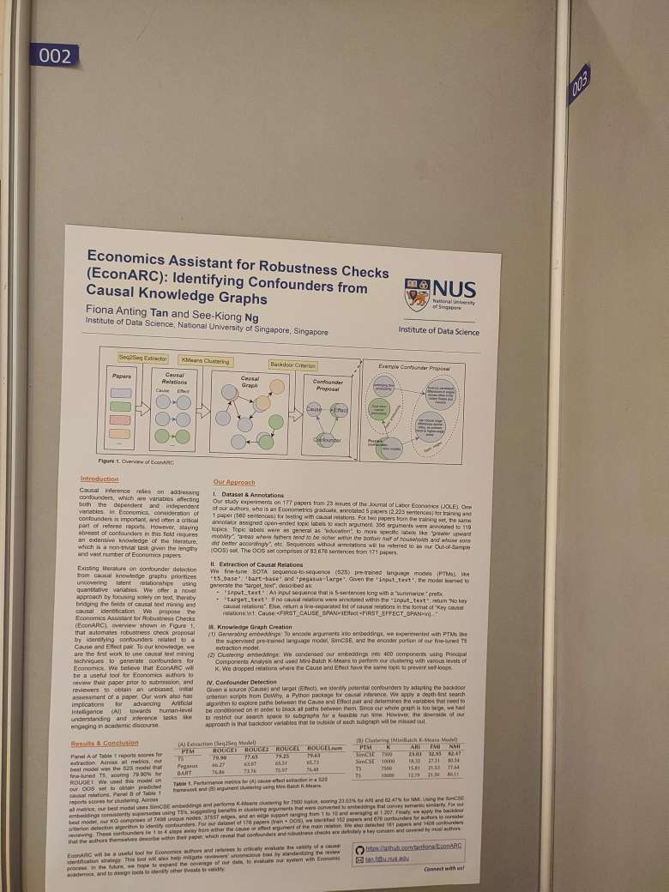

<a href='https://hozo.jp/ISWC2023_PD-Industry-proc/ISWC2023_paper_414.pdf'>Download paper here</a>

<a href='https://github.com/tanfiona/EconARC'>Visit our Github respository here</a>

<h2>Abstract</h2>
In Economics, authors conduct comprehensive robustness checks to prevent drawing misleading conclusions from their causal analyses by accounting for potential confounding factors. To assist in this process, we propose EconARC which offers automated identification of confounders from the literature. Our methodology involves extracting cause-and-effect arguments using a fine-tuned sequence-to-sequence model, clustering semantically similar arguments into topics, and utilizing the backdoor criterion on the causal graph to detect confounders. Our study is the first to employ text mining techniques for generating confounders in Economics, with implications for advancing Artificial Intelligence towards human-level capabilities like engaging in academic discourse.

<h2>Event Photos</h2>

